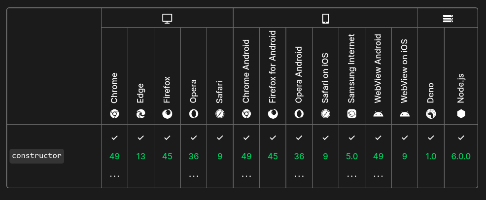
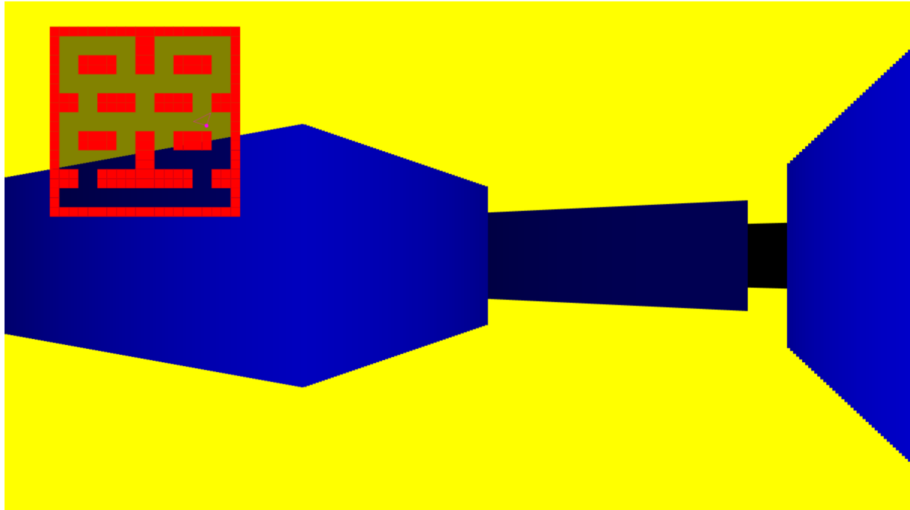
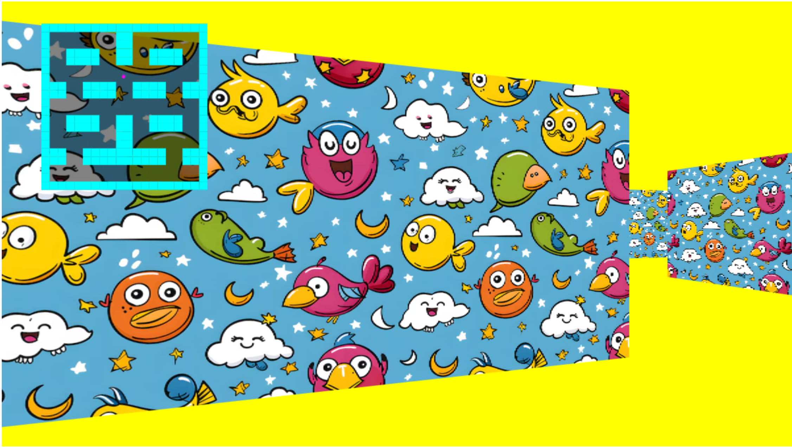

# Violet Ultra JS | Game Engine

> [!WARNING]
> This is a work In Progress! Anything can change at any moment without any notice! Use this at your own risk!

JavaScript Game Engine (uyv.js)

Latest update: 19 October 2024

- Added Quadtree class (19 October 2024)

# Documentation

https://enrique-za.github.io/violet-ultra-js/ 

via JSDoc

# Supported Browser

# Examples

Raycasting (version 1)

> Test in now on GitHub Pages: https://enrique-za.github.io/uyv-raycasting/
> 
> Repository: https://github.com/Enrique-ZA/uyv-raycasting

Raycasting (version 2)

> Test in now on GitHub Pages: https://enrique-za.github.io/uyv-raycasting-v2/
> 
> Repository: https://github.com/Enrique-ZA/uyv-raycasting-v2
